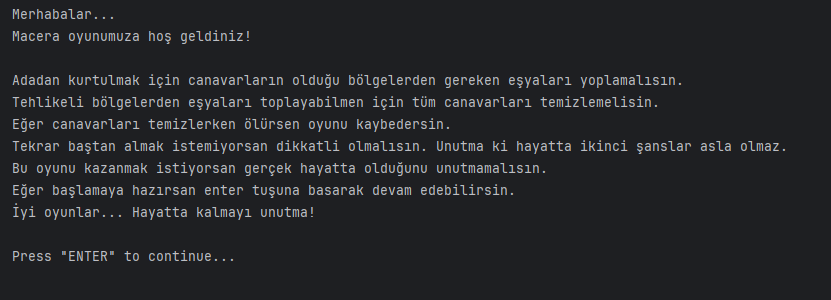
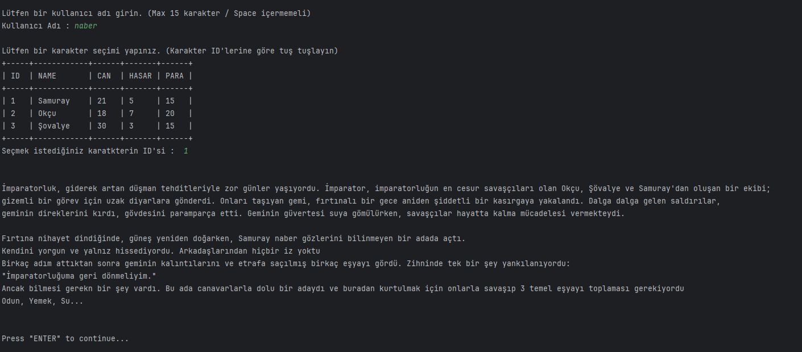
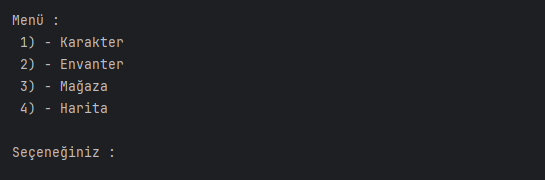
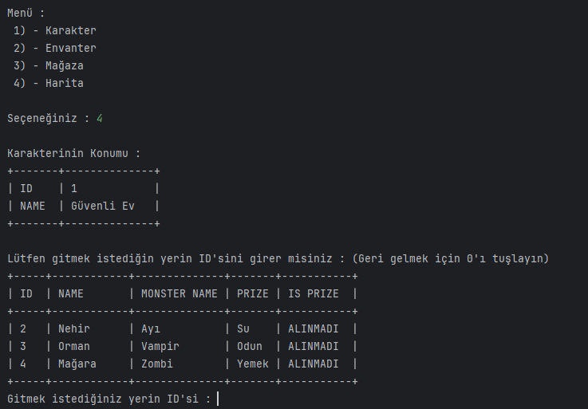
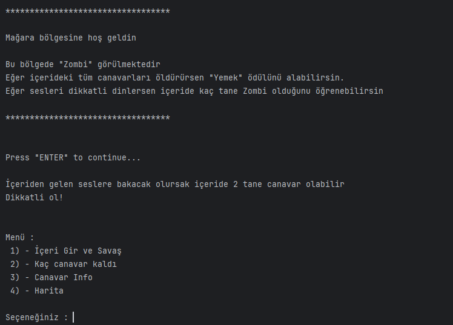

# :game_die: Adventure Game

## :book: İçindekiler

- [Proje Hakkında](#bulb-proje-hakkında)
- [Kurulum ve Çalıştırma](#computer-kurulum-ve-çalıştırma)
- [Oyun Senaryosu](#scroll-oyun-senaryosu)
- [Oyun Mekanikleri](#man_technologist-soyun-mekanikleri)
- [Teknik Mimari ve Tasarım Prensipleri](#gear-teknik-mimari-ve-tasarım-prensipleri)
  - [OOP](#oop)
  - [Katmanlı Mimari](#katmanlı-mimari)
  - [DRY (Don't Repeat Yourself)](#dry-dont-repeat-yourself)
  - [SOLID](#solid)
- [UML Diyagramı](#art-uml-diyagramı)
- [Oyundan Kareler](#camera-oyundan-kareler)

## :bulb: Proje Hakkında

Java tabanlı bu proje, oyuncuyu heyecan dolu ve zorlu bir hayatta kalma mücadelesine davet eden metin tabanlı bir macera oyunudur.

Oyuncular, maceralarına başlamadan önce kendilerine has yeteneklere sahip Samuray, Okçu veya Şövalye gibi kahramanlardan birini seçerek kaderlerini belirler.

Temel hedefiniz, mahsur kaldığınız bu ıssız adadan kurtulmaktır. Zafere giden yol ise, adanın gizemli ve tehlikeli bölgelerinde (Mağara, Orman, Nehir) saklanmış hayati öneme sahip eşyaları ele geçirmekten geçiyor.

Ancak bu hazinelere ulaşmak için, her köşede pusuya yatmış korkunç canavarlarla (Zombi, Vampir, Ayı) yüzleşmeniz gerekecek. Adanın vahşi sakinlerini alt etmek ve hayatta kalma şansınızı artırmak adına, envanterinizi güçlendirerek yeni silahlar ve zırhlar tedarik etmeniz mümkündür.

## :computer: Kurulum ve Çalıştırma

Bu proje, Java tabanlı bir metin tabanlı macera oyunudur ve **IDE (IntelliJ IDEA, Eclipse, VS Code)** üzerinden çalıştırılması önerilir. Terminal üzerinden çalıştırmak için ek konfigürasyon gerekebilir.

### Gereksinimler

- **Java JDK:** 17 veya üstü
- **IDE:** IntelliJ IDEA, Eclipse, VS Code (Java eklentisi ile)
- **Bağımlılıklar:** Projede ek kütüphane veya framework bağımlılığı bulunmamaktadır, yalnızca standart Java kütüphaneleri kullanılmıştır.

### Çalıştırma Adımları

1. Projeyi indirin.
1. Projeyi IDE’ye import edin.
2. **`Main.java`** dosyasını bulun.
3. IDE’nin **Run / Play** butonuna tıklayarak oyunu başlatın.

## :scroll: Oyun Senaryosu

1. :crossed_swords: **Başlangıç**
	- Oyunu adını girer.
	- Karakter seçilir (*Samuray, Okçu, Şövalye*).

2. :house: **Safe House (Güvenli Ev)**  
	- Oyun buradan başlar.  
   	- Oyuncu burada canını yeniler.
	- Envanterini kontrol eder.
	- Mağazaya gidebilir.
	- Haritadan düşman bölgelerine gidebilir.

3. :shopping_cart: **Store (Mağaza)**  
   - Kazanılan paralar ile silah ve zırh satın alınabilir.

4. :dagger: **Düşman Bölgeleri**
	- **Orman**: Vampire ile savaşılır -> Ödül : **Firewood**  
   	- **Mağara**: Zombie ile savaşılır -> Ödül : **Food**  
   	- **Nehir**: Bear ile savaşılır -> Ödül : **Water**  
	- Her bölgede farklı sayıda canavar çıkabilir.
	- Canavarlarla savaşma sırasında ilk vuruş %50-%50'dir.

5. :trophy: **Amaç**  
   - Oyuncu, her bölgedeki canavarları yenip gerekli 3 ödülü toplamalıdır.  

6. :skull: **Sonuç**  
   - Eğer tüm ödüller toplanırsa oyuncu adadan kurtulur -> **OYUNU KAZANIR**.  
   - Eğer karakterin canı sıfırlanırsa -> **OYUN BİTER**. (2. Şans Yok) 

## :man_technologist: Oyun Mekanikleri

### :crossed_swords: Character

| Karakter | Sağlık | Hasar | Para | Açıklama |
| - | - | - | - | - |
| Samurai | 21 | 5 | 15 | Dengeli savaşçı |
| Archer | 18 | 7 | 20 | Yüksek hasar, düşük sağlık |
| Knight | 30 | 3 | 15 | Yüksek sağlık, düşük hasar |

### :round_pushpin: Location

| Bölge | Açıklama |
| - | - |
| Safe House | Güvenli bölge, burada oyuncu mağazadan alışveriş yapı can yenileyebilir |
| Enemy Location | Düşman bölgelerinde karşılaşılan canavarları alt edip ödüller elde eder |

### :japanese_ogre: Enemy Locaiton

| Bölge | Karşılaşılan Canavar | Ödül |
| - | - | - |
| Cave | Zombie | Food |
| Forest | Vampire | Firewood |
| River | Bear | Water |

### :alien: Monster

| Canavar | Sağlık | Hasar | Para |
| - | - | - | - |
| Zombie | 10 | 3 | 4 |
| Vampire | 14 | 4 | 7 |
| Bear | 20 | 7 | 12 |

### :shopping_cart: Store

Oyuncu kazandığı paralar ile mağazadan silah ve zırh alabilir.

:gun: **Weapon**

| Silah | Hasar | Fiyat |
| - | - | - |
| Pistol | 2 | 25 |
| Sword | 3 | 35 |
| Rifle | 7 | 45 |

:coat: **Armor**

| Zırh | Bloklama | Fiyat |
| - | - | - |
| Light | 1 | 15 |
| Medium | 3 | 25 |
| Heavy | 5 | 40 |

## :gear: Teknik Mimari ve Tasarım Prensipleri

Bu proje, Java ile geliştirilmiş bir metin tabanlı macera oyunu olup, özellikle **Nesne Yönelimli Programlama (OOP)** prensipleri temel alınarak tasarlanmıştır. 

### OOP
- **Class & Object :** Oyundaki tüm karakterler, canavarlar, eşyalar ve lokasyonlar nesneler olarak modellenmiştir.
- **Inheritance :** Ortak özellikler üst sınıflarda tanımlanmış, özel davranışlar alt sınıflara aktarılmıştır. (`CoreEntity`, `Player`, `Monster`, `Thing`, `Location`)
- **Polymorphism :** Arayüzler (`IAdventure`, `ISafeHouse`, `IStore`, `IGame`) ile gereksiz detaylar gizlenmiş, yalnızca gerekli metodlar sunulmuştur. 
- **Abstraction :** Arayüzler (`IAdventure`, `ISafeHouse`, `IStore`, `IGame`) ile gereksiz detaylar gizlenmiş, yalnızca gerekli metodlar sunulmuştur.
- **Encapsulation :** Sınıf içi değişkenler `private` veya `protected` olarak tanımlanmış, kontrollü erişim `getter/setter` metodlarıyla sağlanmıştır.

### Katmanlı Mimari

Kod yapısı, oyun iş mantığını, veri modellerini ve kullanıcı etkileşimini katmanlı mimari ile organize ederken, OOP’nin temel kavramlarını da etkin şekilde kullanır.

1. Entity / Model Layer
	- Oyuncular (`Player`, `Samurai`, `Archer`, `Knight`)
	- Canavarlar (`Monster`, `Zombie`, `Vampire`, `Bear`)
	- Eşyalar (`Thing`, `Armor`, `Weapon`, `Light`, `Medium`, `Heavy`, `Sword`, `Pistol`, `Rifle`)
	- Lokasyonlar (`Location`, `SafeLocation`, `EnemyLocation`, `Cave`, `Forest`, `River`, `SafeHouse`)
	- Bu katman, oyundaki tüm veri modellerini ve temel varlıkları temsil eder.

1. Business / Service Layer
	- Oyun iş mantığı burada yer alır (`AdventureService`, `SafeHouseService`, `StoreService`)
	- OOP prensiplerine uygun olarak iş kuralları, savaş mekanikleri, lokasyon işlemleri ve envanter yönetimi bu katmanda gerçekleştirilir.
	- `IAdventure`, `ISafeHouse`, `IStore` gibi arayüzler soyutlama sağlar.

1. Presentation / Game Layer
	- Kullanıcı ile etkileşim (`GameService`, `IGame`)
	- Menü seçimleri, hareketler, savaş ekranı ve kullanıcıdan giriş alma işlemleri bu katmanda yapılır.
	- Bu katman iş mantığı katmanı ile arayüz arası köprü görevi görür.

1. Exception Layer
	- Hata yönetimi (`InValidIdException`)
	- Kullanıcı hataları veya geçersiz girişler bu katmanda ele alınır.

1. Main Class
	- Programın başlangıç noktası (`Main.java`)
	- `GameService` üzerinden oyun başlatılır ve tüm katmanlar koordineli şekilde çalışır.

### DRY (Don't Repeat Yourself)
- Kod tekrarını minimize etmek amaçlanmıştır.
- Ortak işlemler ve kullanıcı etkileşimleri metodlar aracılığıyla tekrar kullanım için soyutlanmıştır.
- Bazı savaş ve lokasyon mantıkları halen küçük ölçekte tekrarlar içeriyor; ilerleyen sürümlerde refactor edilebilir.

### SOLID

1. Single Responsibility Principle (SRP) – Tek Sorumluluk
	- Her sınıfın tek bir sorumluluğu olması amaçlanmış, fakat bazı servis sınıfları hâlâ birkaç işi bir arada yürütüyor. Örneğin AdventureService hem savaş mantığını hem lokasyon değişimini hem de oyuncu bilgilerini yönetiyor; bu, SRP açısından tam olarak ideal değil.

1. Open/Closed Principle (OCP) – Açık/Kapalı
	- Mevcut yapıda yeni karakter, canavar veya silah eklemek mümkün, ancak bazı sınıflar değişiklik gerektirecek şekilde tasarlanmış. Yani OCP prensibine tam olarak uymuyor; genişleme için bazen mevcut kodun değiştirilmesi gerekiyor.

1. Liskov Substitution Principle (LSP) – Yerine Koyma
	- Alt sınıflar üst sınıfların yerine kullanılabiliyor ve temel işlevleri bozmuyor. Bu açıdan LSP büyük ölçüde sağlanmış.

1. Interface Segregation Principle (ISP) – Arayüz Ayrımı
	- Arayüzler ayrı sorumluluklar için oluşturulmuş, fakat bazı metodlar arayüzlerde bir miktar karışmış durumda. Örneğin IAdventure içinde çok sayıda metod var; küçük oyunlarda sorun olmasa da, büyüdükçe arayüzler şişebilir.

1. Dependency Inversion Principle (DIP) – Bağımlılıkların Tersine Çevrilmesi
	- GameService yüksek seviyeli modül, servisler alt seviyede; bağımlılık arayüzler üzerinden sağlanmış. Bu açıdan DIP prensibine uyumlu. Ancak bazı doğrudan bağımlılıklar hâlâ mevcuttur.

> Not: Bu proje için asıl amaç, DRY ve SOLID’i eksiksiz uygulamak değil; temel hedef OOP ve katmanlı mimariyi kullanarak temiz, anlaşılır ve organize bir yapı oluşturmak olmuştur. DRY ve SOLID prensipleri kısmen uygulanmış, bazı eksiklikler mevcut ve ilerleyen sürümlerde iyileştirilebilir.

## :art: UML Diyagramı

## :camera: Oyundan Kareler

* Oyun başlangıç ekranı 

* Karakter Seçimi

* Ana Menu

* Harita Görüntüleme

* Haritada yer değiştirme ve menüsü

