# Adventure Game

## Proje Hakkında

Java tabanlı bu proje, oyuncuyu heyecan dolu ve zorlu bir hayatta kalma mücadelesine davet eden metin tabanlı bir macera oyunudur.

Oyuncular, maceralarına başlamadan önce kendilerine has yeteneklere sahip Samuray, Okçu veya Şövalye gibi kahramanlardan birini seçerek kaderlerini belirler.

Temel hedefiniz, mahsur kaldığınız bu ıssız adadan kurtulmaktır. Zafere giden yol ise, adanın gizemli ve tehlikeli bölgelerinde (Mağara, Orman, Nehir) saklanmış hayati öneme sahip eşyaları ele geçirmekten geçiyor.

Ancak bu hazinelere ulaşmak için, her köşede pusuya yatmış korkunç canavarlarla (Zombi, Vampir, Ayı) yüzleşmeniz gerekecek. Adanın vahşi sakinlerini alt etmek ve hayatta kalma şansınızı artırmak adına, envanterinizi güçlendirerek yeni silahlar ve zırhlar tedarik etmeniz mümkündür.

## Oyun Senaryosu

1. **Başlangıç**
	- Oyunu adını girer.
	- Karakter seçilir (*Samuray, Okçu, Şövalye*).

2. **Safe House (Güvenli Ev)**  
	- Oyun buradan başlar.  
   	- Oyuncu burada canını yeniler.
	- Envanterini kontrol eder.
	- Mağazaya gidebilir.
	- Haritadan düşman bölgelerine gidebilir.

3. **Store (Mağaza)**  
   - Kazanılan paralar ile silah ve zırh satın alınabilir.

4. **Düşman Bölgeleri**
	- **Orman**: Vampire ile savaşılır -> Ödül : **Firewood**  
   	- **Mağara**: Zombie ile savaşılır -> Ödül : **Food**  
   	- **Nehir**: Bear ile savaşılır -> Ödül : **Water**  
	- Her bölgede farklı sayıda canavar çıkabilir.
	- Canavarlarla savaşma sırasında ilk vuruş %50-%50'dir.

5. **Amaç**  
   - Oyuncu, her bölgedeki canavarları yenip gerekli 3 ödülü toplamalıdır.  

6. **Sonuç**  
   - Eğer tüm ödüller toplanırsa oyuncu adadan kurtulur -> **OYUNU KAZANIR**.  
   - Eğer karakterin canı sıfırlanırsa -> **OYUN BİTER**. (2. Şans Yok) 

## Oyun Mekanikleri

### Character

| Karakter | Sağlık | Hasar | Para | Açıklama |
| - | - | - | - | - |
| Samurai | 21 | 5 | 15 | Dengeli savaşçı |
| Archer | 18 | 7 | 20 | Yüksek hasar, düşük sağlık |
| Knight | 30 | 3 | 15 | Yüksek sağlık, düşük hasar |

### Location

| Bölge | Açıklama |
| - | - |
| Safe House | Güvenli bölge, burada oyuncu mağazadan alışveriş yapı can yenileyebilir |
| Enemy Location | Düşman bölgelerinde karşılaşılan canavarları alt edip ödüller elde eder |

### Enemy Locaiton

| Bölge | Karşılaşılan Canavar | Ödül |
| - | - | - |
| Cave | Zombie | Food |
| Forest | Vampire | Firewood |
| River | Bear | Water |

### Monster

| Canavar | Sağlık | Hasar | Para |
| - | - | - | - |
| Zombie | 10 | 3 | 4 |
| Vampire | 14 | 4 | 7 |
| Bear | 20 | 7 | 12 |

### Store

Oyuncu kazandığı paralar ile mağazadan silah ve zırh alabilir.

**Weapon**

| Silah | Hasar | Fiyat |
| - | - | - |
| Pistol | 2 | 25 |
| Sword | 3 | 35 |
| Rifle | 7 | 45 |

**Armor**

| Zırh | Bloklama | Fiyat |
| - | - | - |
| Light | 1 | 15 |
| Medium | 3 | 25 |
| Heavy | 5 | 40 |

## Teknik Mimari 

Proje, katmanlı mimari kullanılarak geliştirilmiştir:  

- **Core Layer** : Temel varlık sınıfları ve ortak özellikler.  
- **Entities Layer** : Oyuncu, canavar, silah, zırh gibi varlıkların modelleri.  
- **Location Layer** : Oyun dünyasındaki bölgeler (SafeHouse, EnemyLocation vb).  
- **Service Layer** : Oyunun iş mantığı (oyuncu yönetimi, mağaza, safe house işlemleri).  
- **Exception Layer** : Geçersiz girişler için özel hata sınıfları.

## UML Diyagramı

```mermaid
classDiagram

	class Main {
	  # game : GameService
	  + main(String[] args) : void
	}

	%% Business Katmanı

	class IAdventure {
		<<interface>>
	    +Intro()
	    +InitializePlayer(name: String, id: int)
	    +History()
	    +CreatePlayer(id: int)
	    +LocationChange(id: int)
	    +War(monster: Monster, player: Player)
	    +IsGameWin()
	    +WinWar()
	    +MonsterAttack(player: Player, monster: Monster)
	    +PlayerAttack(player: Player, monster: Monster)
	    +FirstHit(): int
	    +WinGame()
	    +GameOver()
	    +PrintCurrentLocation()
	    +PrintSafeLocationInfo(locationId: int)
	    +PrintEnemyLocationInfo(locationId: int)
	    +PrintCharacterInfo()
	    +PressEnter()
	    +NewLine()
	}

	class AdventureService {
	    -userName: String
	    -player: Player
	    -safeLocation: SafeLocation
	    -enemyLocation: EnemyLocation
	    -location: Location
	    -listMonster: List~Monster~
	    +AdventureService()
	    +Intro()
	    +InitializePlayer(name: String, id: int)
	    +History()
	    +CreatePlayer(id: int)
	    +LocationChange(id: int)
	    +War(monster: Monster, player: Player)
	    +IsGameWin()
	    +WinWar()
	    +MonsterAttack(player: Player, monster: Monster)
	    +PlayerAttack(player: Player, monster: Monster)
	    +FirstHit(): int
	    +WinGame()
	    +GameOver()
	    +PrintCurrentLocation()
	    +PrintSafeLocationInfo(locationId: int)
	    +PrintEnemyLocationInfo(locationId: int)
	    +PrintCharacterInfo()
	    +PressEnter()
	    +NewLine()
	    +getUserName(): String
	    +setUserName(userName: String)
	    +getPlayer(): Player
	    +setPlayer(player: Player)
	    +getEnemyLocation(): EnemyLocation
	    +setEnemyLocation(enemyLocation: EnemyLocation)
	    +getSafeLocation(): SafeLocation
	    +setSafeLocation(safeLocation: SafeLocation)
	    +getLocation(): Location
	    +setLocation(location: Location)
	    +getListMonster(): List~Monster~
	    +setListMonster(listMonster: List~Monster~)
	}

	class ISafeHouse {
	    <<interface>>
	    +WelcomeToHouse()
	    +PrintCharacterStatus()
	    +ShowEnvanter()
	    +HealthRenewal()
	}

	class SafeHouseService {
	    -player: Player
	    +SafeHouseService(player: Player)
	    +WelcomeToHouse()
	    +PrintCharacterStatus()
	    +ShowEnvanter()
	    +HealthRenewal()
	    +getPlayer(): Player
	    +setPlayer(player: Player)
	}

	class IStore {
	    <<interface>>
	    +WelcomeToStore()
	    +PrintCategories()
	    +BuyArmor(armorId: int): Armor
	    +BuyWeepon(weaponId: int): Weapon
	    +CheckMoney(money: int, price: int): boolean
	    +PrintArmor()
	    +PrintWeepon()
	}

	class StoreService {
	    +WelcomeToStore()
	    +PrintCategories()
	    +BuyArmor(armorId: int): Armor
	    +BuyWeepon(weaponId: int): Weapon
	    +CheckMoney(money: int, price: int): boolean
	    +PrintArmor()
	    +PrintWeepon()
	    -CreateArmorInfo(id: int, name: String, block: int, price: int)
	    -CreateWeepomInfo(id: int, name: String, dmage: int, price: int)
	}

	%% Entity / Model

    class CoreEntitiy {
        -name: String
        -id: int
        -damage: int
        -health: int
        -money: int
        +CoreEntitiy(name: String, id: int, damage: int, health: int, money: int)
        +getName(): String
        +setName(name: String)
        +getId(): int
        +getDamage(): int
        +setDamage(damage: int)
        +getHealth(): int
        +setHealth(health: int)
        +getMoney(): int
        +setMoney(money: int)
    }

    class Player {
        -maxHealth: int
        -blok: int
        -envanter: Envanter
        +Player(name: String, id: int, damage: int, health: int, money: int)
        +updateDmage()
        +updateBlock()
        +getMaxHealth(): int
        +setMaxHealth(maxHealth: int)
        +getBlok(): int
        +setBlok(blok: int)
        +getEnvanter(): Envanter
        +setEnvanter(envanter: Envanter)
    }

	class Monster {
        +Monster(name: String, id: int, damage: int, health: int, money: int)
    }

    class Location {
        -name: String
        -id: int
        +Location(name: String, id: int)
        +getName(): String
        +setName(name: String)
        +getId(): int
    }

	class IObstacle {
        <<interface>>
        +CreateMonster(id: int): List~Monster~
        +WelcomTo(monster: Monster)
        +InfoMonster(monster: Monster)
        +PrintNumberMonster(num: int)
    }

	class EnemyLocation {
        -isPrize: boolean
        -prize: String
        +EnemyLocation(name: String, id: int, isPrize: boolean, prize: String)
        +CreateMonster(id: int): List~Monster~
        +WelcomTo(monster: Monster)
        +InfoMonster(monster: Monster)
        +PrintNumberMonster(num: int)
        +getPrize(): String
        +setPrize(prize: String)
        +isPrize(): boolean
        +setPrize(prize: boolean)
    }

	class SafeLocation {
        +SafeLocation(name: String, id: int)
    }

    class Thing {
        -name: String
        -price: int
        -id: int
        +Thing(name: String, price: int, id: int)
        +getPrice(): int
        +setPrice(price: int)
        +getName(): String
        +setName(name: String)
        +getId(): int
        +setId(id: int)
    }

    class Armor {
        -block: int
        +Armor(name: String, price: int, id: int, block: int)
        +getBlock(): int
        +setBlock(block: int)
    }

    class Weapon {
        -dmage: int
        +Weapon(name: String, price: int, id: int, dmage: int)
        +getDmage(): int
        +setDmage(dmage: int)
    }

    class Light {
        +NAME: String
        +ID: int
        +PRICE: int
        +BLOCK: int
        +Light()
    }

    class Medium {
        +NAME: String
        +ID: int
        +PRICE: int
        +BLOCK: int
        +Medium()
    }

    class Heavy {
        +NAME: String
        +ID: int
        +PRICE: int
        +BLOCK: int
        +Heavy()
    }

    class Pistol {
        +NAME: String
        +ID: int
        +DMAGE: int
        +PRICE: int
        +Pistol()
    }

    class Sword {
        +NAME: String
        +ID: int
        +DMAGE: int
        +PRICE: int
        +Sword()
    }

    class Rifle {
        +NAME: String
        +ID: int
        +DMAGE: int
        +PRICE: int
        +Rifle()
    }

	class Samurai {
        +NAME: String
        +ID: int
        +DEMAGE: int
        +HEALTH: int
        +MONEY: int
        +Samurai()
    }

    class Archer {
        +NAME: String
        +ID: int
        +DEMAGE: int
        +HEALTH: int
        +MONEY: int
        +Archer()
    }

    class Knight {
        +NAME: String
        +ID: int
        +DEMAGE: int
        +HEALTH: int
        +MONEY: int
        +Knight()
    }

    class Zombie {
        +NAME: String
        +ID: int
        +DEMAGE: int
        +HEALTH: int
        +MONEY: int
        +Zombie()
    }

    class Vampire {
        +NAME: String
        +ID: int
        +DEMAGE: int
        +HEALTH: int
        +MONEY: int
        +Vampire()
    }

    class Bear {
        +NAME: String
        +ID: int
        +DEMAGE: int
        +HEALTH: int
        +MONEY: int
        +Bear()
    }

	class SafeHouse {
        +NAME: String
        +ID: int
        +SafeHouse()
    }

    class Cave {
        +ID: int
        +NAME: String
        +PRIZE: String
        +IS_PRIZE_FOOD: boolean
        +CREATE_MONSTER_NAME: String
        +Cave()
    }

    class Forest {
        +ID: int
        +NAME: String
        +PRIZE: String
        +IS_PRIZE_WOOD: boolean
        +CREATE_MONSTER_NAME: String
        +Forest()
    }

    class River {
        +ID: int
        +NAME: String
        +PRIZE: String
        +IS_PRIZE_WATER: boolean
        +CREATE_MONSTER_NAME: String
        +River()
    }

	%% Presentation Layer
    
	class IGame {
        +GameStart()
        +InitializeStart()
        +ToWhereLocation()
        +GoToDoLocationNumber(int)
        +GoToDoCave()
        +GoToDoForest()
        +GoToDoRiver()
        +EntryEnemyLocation(Monster)
        +SelectedOptionEnemyLocationId()
        +OptionsEnemyLocation(int)
        +War()
        +PrintMenuEnemyLocation()
        +HowManyMonster()
        +GoToDoHouse()
        +SelectedOptionHouseId()
        +OptionsHouse(int)
        +PrintOptionsHouse()
        +GoToDoStore()
        +SelectedCategoriesStoreId()
        +SelectedWeaponStoreId()
        +SelectedArmorStoreId()
        +BuyWeapoonById(int)
        +BuyArmorById(int)
        +getSelectedId(Runnable, int...)
    }

    class GameService {
        -adventureService: AdventureService
        -safeHouseService: SafeHouseService
        -storeService: StoreService
        -input: Scanner
        +GameService()
        +GameStart()
        +InitializeStart()
        +ToWhereLocation()
        +GoToDoLocationNumber(int)
        +GoToDoCave()
        +GoToDoForest()
        +GoToDoRiver()
        +EntryEnemyLocation(Monster)
        +SelectedOptionEnemyLocationId()
        +OptionsEnemyLocation(int)
        +War()
        +PrintMenuEnemyLocation()
        +HowManyMonster()
        +GoToDoHouse()
        +SelectedOptionHouseId()
        +OptionsHouse(int)
        +PrintOptionsHouse()
        +GoToDoStore()
        +SelectedCategoriesStoreId()
        +SelectedWeaponStoreId()
        +SelectedArmorStoreId()
        +BuyWeapoonById(int)
        +BuyArmorById(int)
        +getSelectedId(Runnable, int...)
    }

	%% Exception

    class InValidIdException {
        +InValidIdException(String message)
    }

	%% Main

	class Main {
        +main(String[] args)
    }

	IAdventure <|.. AdventureService
	ISafeHouse <|.. SafeHouseService
	IStore <|.. StoreService

	CoreEntitiy <|-- Player
	CoreEntitiy <|-- Monster

	Location <|-- SafeLocation
	Location <|-- EnemyLocation
	IObstacle <|.. EnemyLocation

	Thing <|-- Armor
	Thing <|-- Weapon

    Armor <|-- Light
    Armor <|-- Medium
    Armor <|-- Heavy

    Weapon <|-- Pistol
    Weapon <|-- Sword
    Weapon <|-- Rifle

	Player <|-- Samurai
    Player <|-- Archer
    Player <|-- Knight

	Monster <|-- Bear
	Monster <|-- Vampire
	Monster <|-- Zombie

	EnemyLocation <|-- Cave
	EnemyLocation <|-- Forest
	EnemyLocation <|-- River
	SafeLocation <|-- SafeHouse

	Exception <|-- InValidIdException

	IGame <|.. GameService


    GameService --> AdventureService
    GameService --> SafeHouseService
    GameService --> StoreService
    GameService --> Player
    GameService --> Monster
    GameService --> Weapon
    GameService --> Armor

    SafeHouseService --> Player
    StoreService --> Weapon
    StoreService --> Armor
    AdventureService --> Player
    AdventureService --> Monster
    AdventureService --> Location

	Main --> GameService : uses
    GameService --> InValidIdException : throws
```

## Örnek Oyun Çıktıları